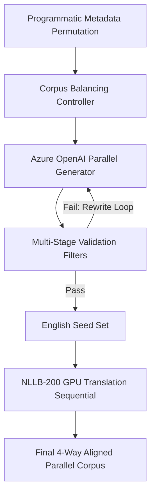

# Dataset Generation and Translation Methodology Report

This report documents the end-to-end methodology used to synthesize and translate the **4-Way Parallel Kenyan Public Service Announcement (PSA) Dataset** (English, Swahili, Somali, Luo).

---

## 1. Core Methodology Overview

The dataset was generated using a hybrid pipeline combining **programmatic metadata planning**, **constrained LLM synthesis**, and **distilled neural machine translation (NMT)**. The process ensures a highly balanced corpus across domains, strict grammatical and stylistic alignment with authentic Kenyan PSAs, and high-fidelity translations.

---

## 2. Step-by-Step Pipeline

### Step 1: Programmatic Metadata Planning & Balancing
To prevent the LLM from inventing metadata (which leads to unbalanced datasets), a programmatic **Balancing Controller** was built:
* **Metadata Permutation**: Randomly selects combinations of `Domain`, `Topic`, `Subtopic`, `Target Institution`, `Audience`, `Hazard`, and `Location` based on pre-defined Kenyan contexts.
* **Corpus Balancing**: Tracks the frequency of selected attributes across batches and dynamically chooses attributes with the lowest generation frequency to guarantee a perfectly uniform distribution across all categories.

### Step 2: Constrained LLM Synthesis (Azure OpenAI GPT-5.1 mini)
The planned facts were sent to Azure OpenAI in parallel batches of 20 using `ThreadPoolExecutor` (10 worker threads) for maximum speed:
* **Style Anchoring**: GPT-5.1 mini was few-shot prompted with authentic Kenyan PSAs from real-world reference datasets (`PSA_KE_Final.csv`) to emulate their action-oriented, direct style.
* **Strict Negative Constraints**:
  * **No Conditional Starts**: Prohibits starting sentences with `"If"`, `"If you"`, `"If eligible"`, or `"If facing"`.
  * **No Passive Subjects**: Prohibits passive structures (e.g., rejecting *"registering is advised"* or *"to submit is required"*).
  * **No Gazette/Press Wording**: Banishes bureaucratic jargon (e.g., rejecting *"pursuant to"*, *"hereby notifies"*, or CS events/launches).
  * **No Trailing Audience Suffixes**: Explicitly forbids appending vocative audience tags (e.g., rejecting *"..., members of the public"* or *"..., candidates"*).

### Step 3: Multi-Stage Programmatic Validation
Every generated PSA is validated in code before saving:
* **Length Constraints**: Must contain between 10 to 25 words (optimized for translation bounds).
* **Format & Punctuation**: Must start with a capital letter, contain no consecutive duplicates, and end in proper punctuation.
* **Regex Filtering**: Verifies the absence of passive subject constructions and trailing vocative tags.
* **Deduplication Check**: Ensures uniqueness using Jaccard word-level similarity scoring.
* Any rejected sentence is fed back into a **self-correction rewrite loop** (up to 3 attempts) with the specific failure reason provided to the model as feedback.

### Step 4: High-Fidelity NMT Translation (NLLB-200 GPU)
Once the English seed set was completed, it was sequentially translated into three target languages on Colab GPUs:
* **Swahili**: Translated using `facebook/nllb-200-distilled-600M`.
* **Somali**: Translated using `facebook/nllb-200-1.3B`.
* **Luo**: Translated using `facebook/nllb-200-1.3B`.
* **Acronym Protection**: Special tokens were registered in the tokenizer to protect Kenyan acronyms (e.g., `SHA`, `HELB`, `NTSA`, `KRA`, `Huduma`) from being corrupted or mistranslated.
* **NumPy 2.0 Resilience**: Wrapped Language Identification calls in try-except blocks to gracefully bypass fasttext copy limitations in newer Google Colab environments.

---

## 3. Dataset Characteristics

* **Total Size**: 50,000+ aligned 4-way parallel records.
* **Format**: 17-column CSV:
  * `PSA_Id`, `Domain`, `Topic`, `Subtopic`, `Class`, `English`, `Kiswahili`, `Somali`, `Luo`, `is_synthetic`, `model_version`, `scenario_id`, `intent`, `severity`, `syntactic_pattern`, `lexical_profile`, `word_count`.
* **Style**: Conversational, action-oriented, direct command sentences tailored specifically to Kenyan public service announcements.

---

## 4. Ekegusii Translation Integration

For the expansion of the dataset to include **Ekegusii (Kisii)**, a low-resource Bantu language, we designed a **Retrieval-Augmented Few-Shot Translation** system.

### Seed Corpus Sources
Because Ekegusii lacks large general parallel datasets, we hand-curated a seed corpus of 14 highly diverse, grammatically verified English-Ekegusii sentence pairs from two primary authoritative sources:
1. **The Ekegusii Revised Bible (*EBIBILIA ENCHENU*)**: Provides formal, command-based grammatical structures (e.g. Genesis 1:1, Matthew 6:33, Psalms 23:1, John 3:16).
2. **The "Four Spiritual Laws" Tract (`4laws.com/laws/ekegusii`)**: Hand-aligned contemporary prose translated by native speakers.

### Domain-Specific Static Few-Shot Prompting
Instead of dynamically retrieving examples per sentence (which is time and token consuming), we pre-configured a static system prompt for each of the core domains (Health, Agriculture/Environment, Security & Safety, Education, Governance) containing domain-relevant verified few-shot translations.

The translation script:
1. Iterates domain-by-domain.
2. Selectes the pre-configured prompt for the active domain.
3. Translates target records in parallel using ThreadPoolExecutor.

### Target Subset
For resource and cost optimization, only a subset of the English dataset is translated to Ekegusii:
* **First 15,000 records** (indices 0 to 14,999)
* **Last 15,000 records** (indices `len(df) - 15000` to `len(df) - 1`)
Any record outside this target range is left blank (`""`) for the Ekegusii column.

### Pipeline Separation
To prevent environment conflicts and provide a clean, user-friendly execution flow, the Colab notebooks are separated:
* **[pipeline.ipynb](file:///C:/Users/Admin/.gemini/antigravity-ide/scratch/psa_generator/pipeline.ipynb)**: Dedicated to GPU-accelerated sequential NMT translation for Swahili, Somali, and Luo.
* **[pipeline_ekegusii.ipynb](file:///C:/Users/Admin/.gemini/antigravity-ide/scratch/psa_generator/pipeline_ekegusii.ipynb)**: Dedicated to OpenAI/Azure LLM-driven Retrieval-Augmented Ekegusii translation.

